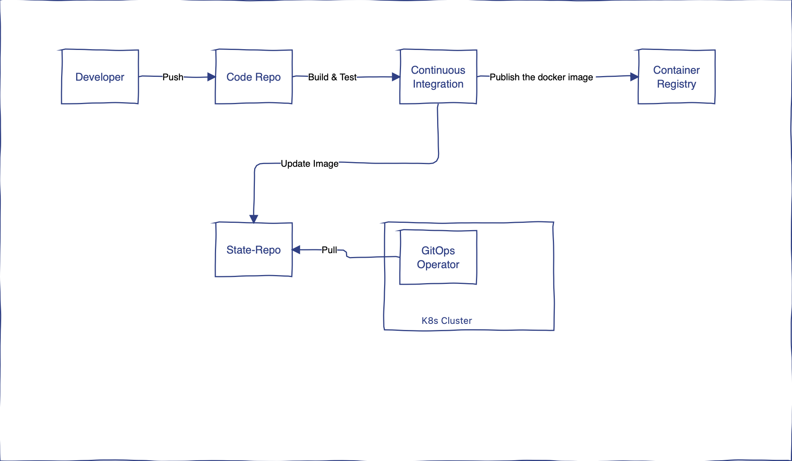

# Advanced GitOps Workflow Design and Implementation:
Problem: Propose an intricate and advanced GitOps workflow for managing a sophisticated application deployment with multiple services and dependencies on Kubernetes. Assume a complex Git repository structure with placeholders for the application code, Helm Charts, and Kubernetes manifests. Leverage your advanced experience to craft a high-level, multistage GitOps workflow, and provide advanced code snippets to demonstrate how this workflow supports automatic application deployment upon changes to the repository.
Deliverables:
1. An elaborate and advanced description of the multistage GitOps workflow, detailing complex interactions and stages (without actual repository content).
2. Advanced code snippets illustrating how the proposed workflow supports continuous deployment in a complex application setup.
3. In-depth documentation explaining the advanced GitOps workflow, focusing on the intricacies demonstrated in your code snippets

## Solution

1. GitOps Workflow in detail
    GitOps is a modern way to make better IaC for delivering apps/services in K8s. It is all about dterminism, idempotence, automation, observability and many other features.

    * How GitOps works
        When we think about GitOps the first thing that comes in our head is that there is Git repository and in that repository we have YAML files describing the state of servies in K8s. For example deployments, services, ingress, secrets etc.

        On the other hand ther is a K8s cluster with all our resourecs forming our application/service.

        The only missing piece is a GitOps operator, which is reasponsible for syncing the state from Git into the K8s cluster. To sync the changes it periodically or by event does following operations
            - Reads the state from the Git 
            - Reads the state from the K8s cluster
            - Compare them
            - Changes the state of the resources depoyed in K8s if needed. 
        
        To enable GitOps, there are many tools/operators in the market now and ArgoCD is one of the CNCF incubating projects.

        One key ingredient to enable GitOps is to have the CI separate from CD. Once CI execution is done, the artifact will be push to the repository and ArgoCD will take care of the CD.

        

        As you can see in the above diagram, the GitOps operator lives within the clsuter and is using pull based deployment machanism.

        