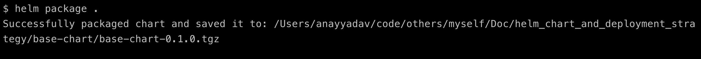

# Complex Helm Charts and Multi-Environment Deployment Strategy

Problem: Given a detailed specification of a fictional application with intricate frontend and backend components, design Helm Chart templates that encapsulate the complexity of the application architecture. Implement a deployment strategy using Helm Charts, considering complex customizations for different environments (e.g., dev, staging, production). Assume the actual application code is not available; generate intricate and representative code snippets to illustrate your approach.
Deliverables:
1. Complex Helm Chart templates for the frontend and backend components, showcasing advanced structuring and customization (with intricate code snippets).
2. An elaborate deployment strategy highlighting complex customizations for different environments, accompanied by advanced code samples.
3. Thorough documentation on how to manage the intricate Helm Charts and customize them based on your provided code samples.

## Solution

1. Creating Helm chart template

    Assumptions
        - Frontend application is in React.js
        - Bacnkend application is in node.js with express framework
        - All the secrets are being stored in hashicorp vault
        - And vault roles and policies are already being created.
        - Vault infra is already in k8s cluster
        - We are using AWS cloud and services like ECR to store the docker image
        - Our frontend serivce is using some of the AWS services like S3 etc.


    - Design the Helm chart
        
        We will not be builing muliple helm charts here, instead we will be builing a base helm chart for applicaiton based on its type like Django, React, spingboot etc.
        This will help us in upgrading the helm charts easily for example, including a way to mount secrets and configmaps dynamically. It is almost certain that the other services will need that same feature. 
        We will be using Helm subchart , a helm's approach of inhertance.

        - A subchart is considered “stand-alone”, which means a subchart can never explicitly depend on its parent chart.
        - a subchart cannot access the values of its parent.
        - parent chart can override values for subcharts.
        - Helm has a concept of global values that can be accessed by all charts.

        ```console
        └── base-chart
            ├── Chart.yaml
            ├── templates
            │   ├── deployment.yaml
            │   ├── hpa.yaml
            │   ├── service.yaml
            |   ├── service_account.yaml
            |   ├── ingress.yaml
            |   ├── pdb.yaml
            └── values.yaml
        ```

    1. Frontend service
        
        Here we will create a subchart for frontend service named "Frontend-Service-Chart" that inherits from the parent "base-chart".
        We will be doing this by defining the base-chart as a dependency.

        The final package will be like this. 

        ```console
        └── Frontend-Service-Chart
            ├── Chart.yaml
            ├── charts
            │   └── base-chart
            │       ├── Chart.yaml
            │       ├── templates
            │       │   ├── deployment.yaml
            │       │   ├── hpa.yaml
            │       │   ├── service.yaml
            │       |   ├── service_account.yaml
            │       |   ├── ingress.yaml
            │       |   ├── pdb.yaml
            │       └── values.yaml
            ├── templates
            └── values.yaml
        
        ```

    2. Backend service

        Here we will create a subchart for backend service named "Backend-Service-Chart" that inherits from the parent "base-chart".
        We will be doing this by defining the base-chart as a dependency. 

        The final package will be like this.

        ```console
        └── Backend-Service-Chart
            ├── Chart.yaml
            ├── charts
            │   └── base-chart
            │       ├── Chart.yaml
            │       ├── templates
            │       │   ├── deployment.yaml
            │       │   ├── hpa.yaml
            │       │   ├── service.yaml
            │       |   ├── service_account.yaml
            │       |   ├── ingress.yaml
            │       |   ├── pdb.yaml
            │       └── values.yaml
            ├── templates
            └── values.yaml

        ```

2. Deployment strategy

    The deployment strategy depends on the continuous delivery tool that one uses based on their use-case like spinnaker, argo-cd with gitops or simplly jenkins to do both CI and CD. 
    Here in this use case we will be doing the deployment manually. 
    
    Deployment steps

    - Check the helm syntax of Base_chart
        ```console
        cd base-chart
        helm lint
        ```

    - Create the sub helm chart for Frontend-Service and add dependencies in Chart.yaml
        ```console
        ## Chart.yaml of Frontend-Service

        apiVersion: v2
        name: Frontend-Service
        description: frontend service helm chart
        type: application
        version: 0.1.0
        maintainers:
        - email: anay@abc.com
        name: Anay Yadav
        dependencies:
        - name: base-chart
            version: 0.1.0

        ```    

        ```console
        ## Chart.yaml of Backend-Service

        apiVersion: v2
        name: Backend-Service
        description: backend service helm chart
        type: application
        version: 0.1.0
        maintainers:
        - email: anay@abc.com
        name: Anay Yadav
        dependencies:
        - name: base-chart
            version: 0.1.0

        ```  
    - Package the base-chart helm template
        
    - Create a chart reposiotry on AWS S3
        1. Install helm s3 plugin
            ```console
            helm plugin install https://github.com/hypnoglow/helm-s3.git
            ```
        2. Init the AWS helm repo
            ```console
            helm s3 init s3://infra-helm-chart
            ```
        3. Add AWS S3 repo to Helm on our working machine, so that we can use the repoitory alias
            ```console
            helm repo add infra-chart s3://infra-helm-chart
            ```
        4. Push to Helm repository on S3
            ```console
            helm s3 push ./base-chart-0.1.0.tgz infra-chart
            ```
        5. Update Chart.yaml
            ```console
            apiVersion: v2
            name: Frontend-Service
            description: frontend service helm chart
            type: application
            version: 0.1.0
            maintainers:
            - email: anay@abc.com
            name: Anay Yadav

            dependencies:
            - name: base-chart
                repository: s3://infra-helm-chart
                version: 0.1.0

            ``` 

            ```console
            apiVersion: v2
            name: Backend-Service
            description: backend service helm chart
            type: application
            version: 0.1.0
            maintainers:
            - email: anay@abc.com
            name: Anay Yadav

            dependencies:
            - name: base-chart
                repository: s3://infra-helm-chart
                version: 0.1.0

            ```
        6. Fill the right values in values.yaml file of both backend-service-chart and frontend-service-chart

            Frontend service 
            ```console
            ## frontend service-chart
            base-chart:
            serviceName: frontend-service
            namespace: demo

            labels:
                app: frontend-service
                infra-env: prod
                infra-service: frontend-service

            ### example autoscaling ###
            autoscaling:
                min: 2
                max: 4
                metrics:
                - type: Resource
                    resource:
                    name: cpu
                    target:
                        type: Utilization
                        averageUtilization: 80
                - type: Resource
                    resource:
                    name: memory
                    target:
                        type: Utilization
                        averageUtilization: 80
                behavior:
                scaleUp:
                    policies:
                    - periodSeconds: 30
                    type: Pods
                    value: 1
                    - periodSeconds: 30
                    type: Percent
                    value: 10
                    selectPolicy: Max
                    stabilizationWindowSeconds: 60
                scaleDown:
                    policies:
                    - periodSeconds: 60
                    type: Pods
                    value: 1
                    selectPolicy: Max
                    stabilizationWindowSeconds: 300

            ##############
            image:
                repository: 741386957827.dkr.ecr.ap-south-1.amazonaws.com/frontend-service:20211111124916'

            affinity: {}

            lifecycle:
                preStop:
                exec:
                    command:
                    - sh
                    - '-c'
                    - sleep 30
            resources:
                limits:
                cpu: 400m
                memory: 1600Mi
                requests:
                cpu: 200m
                memory: 800Mi
            nodeSelector:
                infra-node-group: compute-arm-spot
            env:
                - name: DEPLOYMENT_ENV
                value: prod
            ##############

            ingress:
                - name: frontend-service-public
                annotations:
                    kubernetes.io/ingress.class: kong-abc-public
                rules:
                    - host: frontend-service.abc.com
                    http:
                        paths:
                        - path: /
                            pathType: Prefix
                            backend:
                            service:
                                name: frontend-service
                                port:
                                number: 80

            ##############


            iam_role: arn:aws:iam::741386957827:role/frontend-service
            priorityClass: high-priority
            ```

            Backend service
            ```console
            ## Backend service-chart
            base-chart:
            serviceName: backend-service
            namespace: demo

            labels:
                app: backend-service
                infra-env: prod
                infra-service: backend-service

            ### example autoscaling ###
            autoscaling:
                min: 2
                max: 4
                metrics:
                - type: Resource
                    resource:
                    name: cpu
                    target:
                        type: Utilization
                        averageUtilization: 80
                - type: Resource
                    resource:
                    name: memory
                    target:
                        type: Utilization
                        averageUtilization: 80
                behavior:
                scaleUp:
                    policies:
                    - periodSeconds: 30
                    type: Pods
                    value: 1
                    - periodSeconds: 30
                    type: Percent
                    value: 10
                    selectPolicy: Max
                    stabilizationWindowSeconds: 60
                scaleDown:
                    policies:
                    - periodSeconds: 60
                    type: Pods
                    value: 1
                    selectPolicy: Max
                    stabilizationWindowSeconds: 300

            ##############
            image:
                repository: 741386957827.dkr.ecr.ap-south-1.amazonaws.com/backend-service:20211111124916'

            affinity: {}

            lifecycle:
                preStop:
                exec:
                    command:
                    - sh
                    - '-c'
                    - sleep 30
            resources:
                limits:
                cpu: 400m
                memory: 1600Mi
                requests:
                cpu: 200m
                memory: 800Mi
            nodeSelector:
                infra-node-group: compute-arm-spot
            env:
                - name: DEPLOYMENT_ENV
                value: prod
            ##############

            ingress:
                - name: backend-service-public
                annotations:
                    kubernetes.io/ingress.class: kong-abc-public
                rules:
                    - host: backend-service.abc.com
                    http:
                        paths:
                        - path: /
                            pathType: Prefix
                            backend:
                            service:
                                name: backend-service
                                port:
                                number: 80

            ##############


            iam_role: arn:aws:iam::741386957827:role/backend-service
            priorityClass: high-priority
            ```
        7. Pull the dependent char from s3 bucket
            ```console
            helm dependency update

            ```
        8. Check the wehether helm is generating right k8s manifest file using below commands
            ```console
            helm template .
            ```
        9. Deploy the application with the updated values.yaml file

            Deploy the frontend service
            ```console
            helm install -f values.yaml frontend-service frontend-service-chart/
            ```

            Deploy the backend service
            ```console
             helm install -f values.yaml backend-service backend-service-chart/
            ```